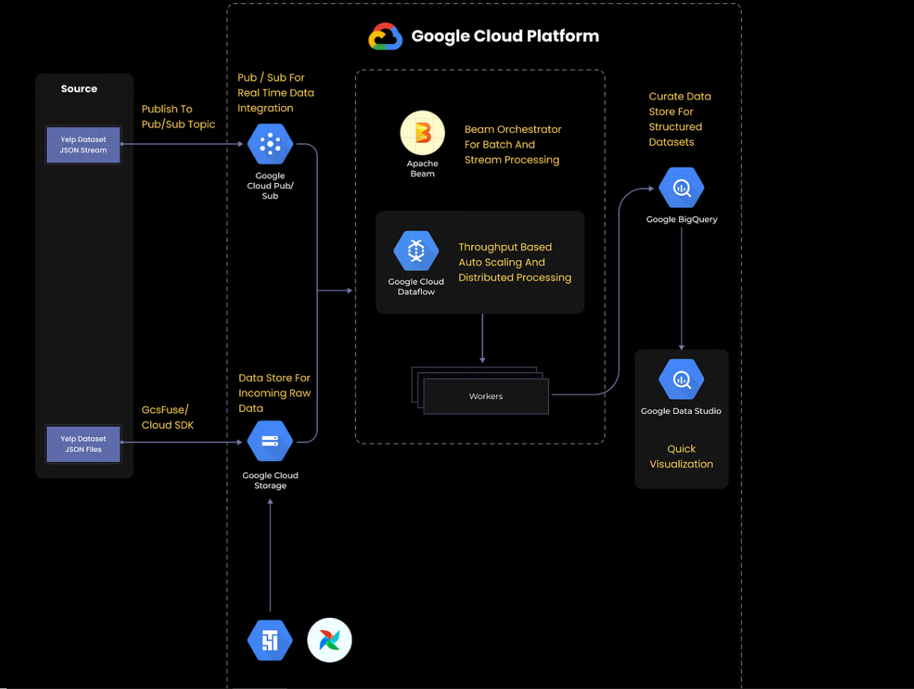

# GCP Data Ingestion with SQL using Google Cloud Dataflow
In this project, I designed and implemented a comprehensive data ingestion and processing pipeline on the Google Cloud Platform (GCP) using the Yelp dataset. This project encompassed both real-time streaming and batch processing capabilities, leveraging multiple GCP services for a robust and scalable solution.

# Data Ingestion
Data ingestion is the process of transporting data from various sources to a centralized storage location where it can be accessed and analyzed. The storage destination can be a data warehouse, database, data mart, or document store. In this project, data was ingested from various sources, including JSON files, RDBMS, and other databases such as S3 buckets and CSV files.

# Data Pipeline
A data pipeline refers to a system for moving data from one system to another. It may involve data transformation and processing in real-time (streaming) or in batches. The pipeline handles extracting data using various tools, storing raw data, cleaning, validating, transforming data into queryable formats, visualizing KPIs, and orchestrating the entire process.

# Project Agenda
The agenda of this project was to create a data ingestion and processing pipeline on GCP with both real-time streaming and batch processing capabilities. The key steps involved in this project included:

# Setting up the Environment:

Created a service account on GCP and downloaded the Google Cloud SDK.
Installed Python and other dependencies to connect with the GCP account.
# Data Ingestion:

Downloaded the Yelp dataset in JSON format for academic and research purposes.
Used Cloud SDK to transfer the dataset to Google Cloud Storage (GCS).
Established connections between GCS, Cloud Composer, and Pub/Sub for data ingestion.
# Real-time Streaming:

Published Yelp dataset JSON streams to Google Pub/Sub topics for real-time data ingestion.
Employed Apache Beam for processing real-time data from Pub/Sub.
# Batch Processing:

Connected JSON files to Cloud Storage Fuse for raw data storage.
Utilized Cloud Composer (Airflow) for scheduling and orchestrating batch workloads.
Implemented Apache Beam for batch data processing, scaling compute resources based on throughput.
# Data Processing and Storage:

Created data pipeline jobs in Google Dataflow to handle stream and batch data processing.
Used Google BigQuery as a data warehouse to store structured data and run queries.
# Data Visualization:

Visualized data using Google Data Studio, creating various graphs and table definitions to derive insights.
Usage of Dataset
Yelp Dataset File: JSON files were ingested into GCS via Cloud Storage Fuse or Cloud SDK. The raw data was then processed using Cloud Composer for batch workloads.

Yelp Dataset Stream: JSON streams were published to Google Pub/Sub for real-time data ingestion, followed by processing with Apache Beam.

# Data Analysis
The Yelp dataset was downloaded in JSON format and ingested into GCP via Cloud SDK or GCS Fuse.
Scheduled and orchestrated batch workloads using Cloud Composer/Airflow.
Published JSON streams to Google Pub/Sub for real-time data ingestion.
Created data pipelines with Apache Beam to process both real-time and batch data in Google Dataflow.
Utilized Google BigQuery to store and query structured data received from workers.
Visualized data using Google Data Studio, showcasing insights through graphs and tables.
# Key Technologies
Google Cloud Platform (GCP): Google Cloud Storage, Cloud Composer, Pub/Sub, Dataflow, BigQuery, Data Studio
Apache Beam: Used for orchestrating and processing stream and batch jobs.
Python: Employed for script automation and GCP SDK integration.
# Architecture Diagram

